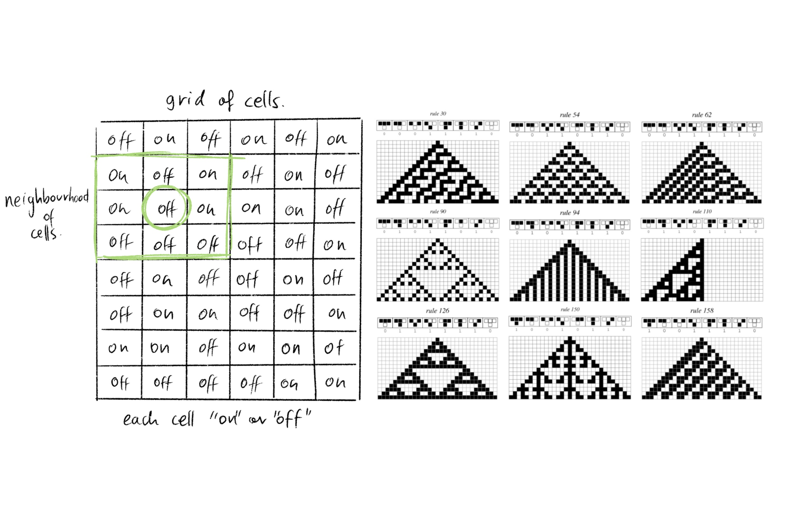

_Rosa Benítez Assignment:_
# Landscape Generation
A landscape generator that uses the cellular automaton model to create seemingly random landscapes. 

## Initial Research 
Cellular automata are discrete abstract models of computation which have proven useful in many areas and scientific fields. Essentially, a cellular automaton consists of a system of ‘cell’ objects with the following three features: they are defined on a grid (of one, two or even more dimensions), they each have a state (“on” and “off” being the simplest, but can have more), and each cell has a neighbourhood of cells (usually defined as the adjacent cells). The cells are then each assigned an initial state which is recalculated for the next iteration based a selected rule, which takes into account the neighbourhood of cells and their previous states.

This concept was developed by Jon von Neumann and Stanislaw Ulam in the 1940s to explore self-replication and crystal growth respectively. Over the years  there have been many studies of it but it was Stephen Wolfram’s investigation of one-dimensional cellular automata and his visual output, what sparked my curiosity in this area. 


_Image: cellular automata concept and Wolfram rules_

However, my greatest inspiration for the project was Jon Conway’s “Game of Life”, a two-dimensional cellular automaton with incredibly simple rules for the states, which nonetheless create amazing configurations. It is this idea of having simple rules have drastic effects what really fascinates me and what I wanted to explore in my project.


_Image: Game of Life rules and example of drastic effect they can have_

I decided to see if I could apply it to landscape generation as I thought it could be an interesting idea that was within the scope of the project. I also want to explore this because using cellular automata concepts in the context of environment design, is something that could potentially allow for the creation of entirely original spaces. Moreover, I did some research into landscape generators and the types of interface parameters they provide, as well as into using cellular automata to generate maps. Despite this research into landscape generation specifically, the “Game of Life” remained my main influence.

### How it would work – the project concept
For this assignment my aim was to apply the cellular automaton model to simple landscape generation. In essence the idea is to explore the evolution of a landscape by local rules so height H(i,j) changes at a given moment in time depending on the properties of its immediate neighbours on the previous time instant.

From the beginning I knew the landscape could be defined by a height function, and an equispaced point cloud of the landscape surface could be described by:

    x=change in x * i
    y=change in y * j
    z=H(i,j)

If n is the index of time the landscape at a given instant in time is Hn (i,j) and i could define the next instant by adding a scale factor delta, multiplied by a matrix of weights associated to the left, right, centre, bottom, and top points around point i,j, and multiplied to the height at the previous instant.


```

.       .       .       .       .


.       .    (i,j+1)    .       .


.    (i-1,j)  (i,j)  (i+1,j)    .


.       .    (i,j-1)    .       .


.       .       .       .       .


```

```

                                        |Hn(i-1,j)|        
                                        |Hn(i+1,j)|
Hn+1(i,j)=Hn(i,j) + deltaz *(L R C B T) | Hn(i,j) |
                                        |Hn(i,j-1)|
                                        |Hn(i,j+1)|


```

(LRCBT are the weights for Left, Right, Centre, Bottom, Top and deltaz is scale factor ) 
(note: the Hn block is supposed to be one matrix of 5x1 but i dont know how to type that in a readme file)


From doing the initial maths, I supposed that depending on the rules, the landscape plane itself could either move or stay at initial level. If the LRCBT added up to a negative number it would move up, if positive the it would go down, and if LRCBT added up to 0 then the plane would stay in place. However, this was simply a hypothesis at this stage, and it wasnt until much later that it was proven.


## Initial Design Considerations
I had some initial ideas on how the project would be built, some of which remained true throughout and others which changed during the development. 

I knew from the beginning that I was going to need to generate and store the landscape points, although I was still unsure as to whether i’d want to store their value for all iterations or not. Initially I planned to make each point have a H(i,j) value from 0 to 255, capping it at 0 and 255 so if it went beyond the value becomes saturated. Then it would be like 128 was a plane surface of mid maximum height, allowing me to make some sections of the grid 0, and see the effects the ‘ditch’ would  create through iterations. I ended up changing the 0-255 interval to 0-1 and then to -5.f to 5.f to facilitate the visualisation process, but the concept itself stayed the same.

A concern I had early on was on how I would define the boundary condition of the landscape as the edges wouldn’t have neighbours. I soon realised though that It would be simple to make it cyclic so the point to the left of the point 0,j is the N-1 and so on.


_Image: Boundary and world axis diagram_

Another thing I had to consider at the start of the project was the world axis orientation. After some contemplation, I decided that the z-axis would be considered up and everything would have to be calculated accordingly. This proved to be slightly inconvenient as the NGL standard is using y-axis as up, but since it made more sense in my mind with the maths I had initially done for the project, it was worth it.

## Project Development
### Generation
#### Making a grid of vertices – mesh.h (making one landscape)
The first thing I set out to do was to visualise a grid of vertices I could have access to and thus later alter. To do this I created the class Mesh.h, which at this stage just had the std:vector <ngl::Vec3> m_gridPoints and m_gridNorms, as well as the mesh width and depth. 

I then used a method I called initialiseLandPoints to loop through the depth and width of the landscape and set m_gridPoints. Since first I just wanted to visualise a grid, I set the height z to 0. However, to check my visualisation was working properly, I set z to a parabole and a sin+cos. This is when I noticed that there was an issue with my triangle strips, although I didn’t go back to fix it till I had advanced on other areas of my project.


_Image: Grid with parabola and equation_

The actual representation at this point was done using ngl::simpleVAO, triangle strips and the ngl::nglColourShader defaults. I also used NGL’s vertData to make a std::vector<ngl::vertData> to store the indexed data. The actual indexing was done by looping through till width-1 and depth, and storing two points at the same time, so one can do the triangle strip. I’m aware that my program would have been more optimised if I had used an Index Buffer Object instead, as instead I am repeating the storing of points. However, I dont regret the choice as using SimpleVAO allowed me to really understand how both triangle-strips and openGL work in depth.


_Image: Diagrams of building loop_

```
//fill in a the vertData structure and add to the data list for the landscape
  unsigned int index=0;
  //note the loop is till i == width-2
  for( size_t i = 0; i < _landscape.getWidth()-1; ++i )
  {
    for( size_t j = 0; j < _landscape.getDepth(); ++j )
    {
      //fill the normals
      d.nx = _landscape.getGridNorms(j+i*_landscape.getDepth()).m_x;
      d.ny = _landscape.getGridNorms(j+i*_landscape.getDepth()).m_y;
      d.nz = _landscape.getGridNorms(j+i*_landscape.getDepth()).m_z;
      //fill the points - note pivot adjustment
      d.x = (_landscape.getGridPoints(j+i*_landscape.getDepth()).m_x)-_landscape.getWidth()/2.f;
      d.y = (_landscape.getGridPoints(j+i*_landscape.getDepth()).m_y)-_landscape.getDepth()/2.f;
      d.z = _landscape.getGridPoints(j+i*_landscape.getDepth()).m_z;
      //fill uvs
      d.u  = j/_landscape.getDepth();
      d.v  = i/_landscape.getWidth();

      //add to the data list
      data[index++]=d;

      //fill for i+1
      //fill the normals
      d.nx = _landscape.getGridNorms(j+(i+1)*_landscape.getDepth()).m_x;
      d.ny = _landscape.getGridNorms(j+(i+1)*_landscape.getDepth()).m_y;
      d.nz = _landscape.getGridNorms(j+(i+1)*_landscape.getDepth()).m_z;
      //fill the points - note pivot adjustment
      d.x = (_landscape.getGridPoints(j+(i+1)*_landscape.getDepth()).m_x)-_landscape.getWidth()/2.f;
      d.y = (_landscape.getGridPoints(j+(i+1)*_landscape.getDepth()).m_y)-_landscape.getDepth()/2.f;
      d.z = _landscape.getGridPoints(j+(i+1)*_landscape.getDepth()).m_z;
      //fill uvs
      d.u  = j/_landscape.getDepth();
      d.v  = (i+1)/_landscape.getWidth();

      //add to the data list
      data[index++]=d;
      
    }//end inner loop
    ...
  }//end outer loop
  ```

#### Making Multiple Landscapes – Evolution.h
Evidently, the main idea of this project relies on my ability to generate and store multiple landscapes, which will be generated iteratively from the first landscape. Because of this, after making Mesh.h I had to consider again the design approaches I could take to make this happen. I briefly considered recalculating each specific landscape iteration when requested without storage, but I then decided to instead store all the landscape iterations so I could perhaps go backwards and forwards through the iterations to show the ‘growth’ of the landscape through time. I thus made the design choice of using initialiseLandPoints() for the first landscape, using a separate function to apply the rules to it and its future iterations, and using my painting method to just paint the landscape it is indicated. 

Due to this I decided to make a class called Evolution.h, which contained an array of Meshes called m_iterations, as well as the number of iterations of the landscape.

#### Filling the Landscapes
This class is also where I wanted to apply the mathematical rules that would actually generate the landscape so I also set the parameters for it. 
To fill the array of landscapes I made a method called fillArray() which looped from 1 until it reached the iteration number requested. The reason the loop doesn't start at 0, is that outside of this function I already set the first landscape in the array (0) to be the initial landscape (made by initialiseLandPoints()). Inside the loop I calculate the current landscape by calling a function to apply the rules using the landscape of the previous generation. 
```
void Evolution::fillArray()
{
    //for each landscape, excluding the initial one,
    //and up to the iteration number inputted, we apply the height rules
    //using the previous iteration landscape as input
    for(size_t t= 1; t<=m_iterationNum; ++t)
    {
      m_iterations[t] = applyRules(m_iterations[t-1]);
    }
}
```
_Code: function to fill the array_


_Image: key formula_

The function applyRules essentially uses the input mesh landscape to apply the  maths to it for every point in the landscape, calculating the height. It then sets the m_gridPoints and m_gridNormals, and returns the mesh of the next landscape iteration to the one it received.  So it calculates the next landscape iteration based on the heights of the previous iteration landscape. 
```
  //loops through the points in the landscape grid
  for(int j=0; j<_previousLandscape.getDepth();++j)
  {
    for(int i=0; i<_previousLandscape.getWidth();++i)
    {
      //calculates the height
      h = _previousLandscape.getGridPoints(j*_previousLandscape.getWidth()+i).m_z
          + m_delta*(m_left*_previousLandscape.getGridPoints(j*_previousLandscape.getWidth()+fmod((i-1+_previousLandscape.getWidth()),_previousLandscape.getWidth())).m_z
          + m_right*_previousLandscape.getGridPoints(j*_previousLandscape.getWidth()+fmod((i+1),_previousLandscape.getWidth())).m_z
          + m_centre*_previousLandscape.getGridPoints(j*_previousLandscape.getWidth()+i).m_z
          + m_bottom*_previousLandscape.getGridPoints((fmod((j-1+_previousLandscape.getDepth()),_previousLandscape.getDepth()))*_previousLandscape.getWidth()+i).m_z
          + m_top*_previousLandscape.getGridPoints((fmod((j+1),_previousLandscape.getDepth()))*_previousLandscape.getWidth()+i).m_z);

       //sets the new grid points with new z-value
       nextLand.setGridPoints(ngl::Vec3(i,j,h));
       //sets the new grid normal points
       nextLand.setGridNorms(ngl::Vec3(0.f,0.f,1.f));
       //sets the new grid colour after calling a function to calculate it
       nextLand.setGridColour(nextLand.calculateColour(h,m_evolutionColourPalette));
     }
  }
  return nextLand;
```
_Code: applyRules function implementing the math rules_


At this stage, I thought it crucial to see if the iterations were working so I hard coded a ‘well’, when in the initialiseLandPoints(). This was simply so I could see the difference between iterations, which would not have been possible if my inisitialiseLandPoints() were still setting the heights to 0. 


_Image: Hard-coded well and evolution - proof of concept_


### Visualisation Additions
#### Mouse
As I started generating landscapes I realised I couldn’t really see them properly or gage if the parameters I had used to generate them were appropriate. Because of this, I added mouse controls early on in the project, so I could rotate, translate and zoom into the landscapes. This allowed me to understand better what I was generating, which was vital throughout the development of the project.
To add the controls I used Jon Macey’s NGLSceneMouseControls as a base, and altered it so it uses the Z-axis as up instead of the Y-axis.
When adding mouse controls, an issue that arose was the pivot of my landscape. Since I was painting the grid from (0,0,0) this was being treated as the pivot, leading to very poor and unintuitive mouse controls. To fix this I simply subtract from x the landscape width/2 and from y the landscape depth/2 when setting the points to be displayed on-screen. 


_Image: Unintuitive controls_


#### Implementing Colours
From early on in the project, I knew I wanted to be able to change the colour depending on the height value to see the full effect of the landscape rules. 

At first I just wanted to visualise some colour, so instead of using ngl::verData as I was doing before, I made my own structure and added colour to it.  Then I included it in the paint loop where I was setting the points and normals. 

In addition, I made and implemented a Fragment and Vertex Shader. Originally I controlled the colours from within the shaders but I soon realised this was incredibly impractical as it would be better to have full control and storage of these colours from within the main program.  

After rethinking the design, I decided to store the colour of each vertex point inside the mesh.h as a vector vec3 m_colour. This made more sense as I could apply the colours from the same class I was applying the landscape rules. 


_Image:landscape with initial colours to visualise effect_

Initially the colour rules were hardcoded into both the applyRules() and the initialiseLandPoints(), (as the initial landscape also should abide by the same colour rules). However, this was clearly very impractical since I was repeating a lot of lengthy code. I therefore made a function calculateColours which returned the colour depending on the height of the landscape point. Since this function needed to be called from both the Mesh class and the Evolution class, I made the classes friends. 

My original calculateColours was a long list of if-statements, but I changed that to using the floor function and calculating the colour bands in less code. Later I also added the option to alternate between three colour palettes I designed.
```
  //calculate the colour bands depending on height range and value
  float delta = (maxHeight-minHeight)/numberOfColours;
  int k = floor((_height-minHeight)/delta);
  //define what colours to use when k is out of bounds
  if(k>=numberOfColours) {k = numberOfColours - 1;}
  if(k<0) {k=0;}
    ...
    ...
    ...
  //returning the colour of the band
  //depending on the user palette choice
  if(_paletteChoice == 1)
  {
    return paletteOne[k];
  }
  if(_paletteChoice == 2)
  {
    return paletteTwo[k];
  }
  if(_paletteChoice == 3)
  {
    return paletteThree[k];
  }
  else ...
```
_Code: section of the calculateColour function_


_Image: colour palette options_

#### Fixing the Grid
Once I had advanced the main conceit of the project, the iterations, I went back to adjust the visualisation and fix the painting of the grid points.
Since I had opted to use ngl::SimpleVAO, instead of making a different set-up with ngl::SimpleIndexedVAO, I needed to change how I was indexing the points from within the loop I was setting them. 


_Image: view before and after fixing it through degenerating triangles_

After careful inspection, it could be seen from the landscapes that the issue was with indexing into a new line and drawing unwanted triangles to it. I know that in openGL you can enable primitive restart to avoid this problem, but I instead decided to deprecate the border triangles by storing extra points. 
I decided to repeat vertices to create degenerate triangles that would be skipped when encountered by the GPU. These degenerate triangles link each row with the next as seen in the diagram above. Also, since I was setting two vertices at a time (i and i+1), I had to ensure that it would not do that for the final row (as there would be no i+1). 
```
...
}//end inner loop
//as long as it's not the last triangle strip point
    if(i<_landscape.getWidth()-2)
    {
      //repetition of last point of row
      //fill the normals
      d.nx = _landscape.getGridNorms(_landscape.getDepth()-1+(i+1)*_landscape.getDepth()).m_x;
      d.ny = _landscape.getGridNorms(_landscape.getDepth()-1+(i+1)*_landscape.getDepth()).m_y;
      d.nz = _landscape.getGridNorms(_landscape.getDepth()-1+(i+1)*_landscape.getDepth()).m_z;
      //fill the points - note pivot adjustment
      d.x = (_landscape.getGridPoints(_landscape.getDepth()-1+(i+1)*_landscape.getDepth()).m_x)-_landscape.getWidth()/2.f;
      d.y = (_landscape.getGridPoints(_landscape.getDepth()-1+(i+1)*_landscape.getDepth()).m_y)-_landscape.getDepth()/2.f;
      d.z = _landscape.getGridPoints(_landscape.getDepth()-1+(i+1)*_landscape.getDepth()).m_z;
      //fill the colour
      d.r = _landscape.getGridColour(_landscape.getDepth()-1+(i+1)*_landscape.getDepth()).m_r;
      d.g = _landscape.getGridColour(_landscape.getDepth()-1+(i+1)*_landscape.getDepth()).m_g;
      d.b = _landscape.getGridColour(_landscape.getDepth()-1+(i+1)*_landscape.getDepth()).m_b;
      //fill uvs
      d.u  = (_landscape.getDepth()-1)/_landscape.getDepth();
      d.v  = (i+1)/_landscape.getWidth();

      //add to the data list
      data[index++]=d;

      //repetition of first point of next row
      //fill the normals
      d.nx = _landscape.getGridNorms((i+1)*_landscape.getDepth()).m_x;
      d.ny = _landscape.getGridNorms((i+1)*_landscape.getDepth()).m_y;
      d.nz = _landscape.getGridNorms((i+1)*_landscape.getDepth()).m_z;
      //fill the points - note pivot adjustment
      d.x = (_landscape.getGridPoints((i+1)*_landscape.getDepth()).m_x)-_landscape.getWidth()/2.f;
      d.y = (_landscape.getGridPoints((i+1)*_landscape.getDepth()).m_y)-_landscape.getDepth()/2.f;
      d.z = _landscape.getGridPoints((i+1)*_landscape.getDepth()).m_z;
      //fill the colour
      d.r = _landscape.getGridColour((i+1)*_landscape.getDepth()).m_r;
      d.g = _landscape.getGridColour((i+1)*_landscape.getDepth()).m_g;
      d.b = _landscape.getGridColour((i+1)*_landscape.getDepth()).m_b;
      //fill uvs
      d.u  = 0;
      d.v  = (i+1)/_landscape.getWidth();

      //add to the data list
      data[index++]=d;
    }
    else
    {
      //repetition of last point of row
      //fill the normals
      d.nx = _landscape.getGridNorms(_landscape.getDepth()-1+(i+1)*_landscape.getDepth()).m_x;
      d.ny = _landscape.getGridNorms(_landscape.getDepth()-1+(i+1)*_landscape.getDepth()).m_y;
      d.nz = _landscape.getGridNorms(_landscape.getDepth()-1+(i+1)*_landscape.getDepth()).m_z;
      //fill the points - note pivot adjustment
      d.x = (_landscape.getGridPoints(_landscape.getDepth()-1+(i+1)*_landscape.getDepth()).m_x)-_landscape.getWidth()/2.f;
      d.y = (_landscape.getGridPoints(_landscape.getDepth()-1+(i+1)*_landscape.getDepth()).m_y)-_landscape.getDepth()/2.f;
      d.z = _landscape.getGridPoints(_landscape.getDepth()-1+(i+1)*_landscape.getDepth()).m_z;
      //fill the colour
      d.r = _landscape.getGridColour(_landscape.getDepth()-1+(i+1)*_landscape.getDepth()).m_r;
      d.g = _landscape.getGridColour(_landscape.getDepth()-1+(i+1)*_landscape.getDepth()).m_g;
      d.b = _landscape.getGridColour(_landscape.getDepth()-1+(i+1)*_landscape.getDepth()).m_b;
      //fill uvs
      d.u  = (_landscape.getDepth()-1)/_landscape.getDepth();
      d.v  = (i+1)/_landscape.getWidth();

      //add to the data list
      data[index++]=d;
    }
  }// end outer loop
  ```
  _Code: changes to the building function seen previously. Its from within the outer loop (of i<width-1)_
  
### User Interface
For this project I wanted the user to be able to at least alter the simple rules and see the result they have on the landscape. Because of this I decided to add a Graphic User Interface. I had very little experience making these but I still wanted to make one that would allow for the user to define the initial landscape as well, granting the power to create a myriad of intriguing terrains. Additionally, I thought that giving the user the ability to chose which iteration of the landscape to view would be a great way of seeing how the cellular automata model works on the environment.
 
A lot of design changes came with the implementation of the GUI in order to make my set-up more event-driven. For example, some calls that were previously in the initializeGL, had to be moved into separate functions in order to be called multiple times during run-time.
 
#### Input Areas
When first developing my project, I was hard-coding an initial landscape but this was an impractical process, so I decided to design a better way to alter the start landscape. This was also in anticipation of making the GUI. 

I decided that with my limited Qt GUI knowledge, the best way to have the user change the land would be to have them input the dimensions and position of a rectangle, which also would have a value that is either positive or negative. The idea was that then I would set the section of the initial landscape corresponding to the input rectangle to the value the user also input, and then set the rest of the grid to 0. This way the user would be able to define the starting height of a section of the landscape that they chose. 


_Image: example of iterations using one sole input area_

Moreover, I wanted them to be able to input multiple areas in order to provide more landscape flexibilities, which lead to me redesigning my initialiseLandPoints function. I made an InputArea.h, defining a struct to store the x position and y position of box, the side x, side y and the height value. The reason I didn’t limit user input to a square (and use a vec4) was because I wanted the ability to make a side length longer than the landscape and create a starting landscape with a valley or mountain range. However, I did limit the number of input areas to four because it offers a lot of possibilities without overwhelming the interface.
```
void Mesh::initialiseLandPoints()
{
  //to initialise the starting landscape either
  //with default grid or with user input areas
  //internal variable h for height
  float h=0.f;

  //loop for every point in the landscape
  for(int j=0; j<getDepth();++j)
  {
    for(int i=0; i<getWidth();++i)
    {
      //flag set up
      bool isPointInInputArea = false;
      //loop through the array of input areas
      for (int n=0; n<4; ++n)
      {
        //if the point is inside any of the input areas,
        //the point z-axis is set to the input area height value
        if(isPointInInputArea == false
           && j<((getInputAreas(n).posX+(getInputAreas(n).sideX/2)))
           && j>((getInputAreas(n).posX-(getInputAreas(n).sideX)/2))
           && i<((getInputAreas(n).posY+(getInputAreas(n).sideY)/2))
           && i>((getInputAreas(n).posY-(getInputAreas(n).sideY)/2)))
           {
             h = getInputAreas(n).value;
             m_gridPoints.push_back(ngl::Vec3(i,j,h));
             isPointInInputArea = true;
           }
       }
       //if the point already is in a different input area then the
       //z-axis is set to 0, height is 0
       if (isPointInInputArea == false)
       {
         h = 0.f;
         m_gridPoints.push_back(ngl::Vec3(i,j,h));
       }
         m_gridNorms.push_back(ngl::Vec3(0.f,0.f,1.f));
         //set the colour after calculating it, taking account the height and palette choice
         m_colour.push_back(calculateColour(h,getColourPalette()));
     }
  }
}
```
_Code: InitialiseLandPoints adapted to take into account the input areas_


_Image: example of  the flexibility using input rectangles instead of squares provides_

By design, if input areas overlap, the rectangle first defined takes precedence and its value will be visualised. 


_Image: considerations of the design and how they are visualised_

I made a button per input area that would trigger a function to set those parameters. It is set-up so regardless of the landscape’s real dimensions, the user always inputs within 0-100. 

```
void NGLScene::setAreaOne(int _x, int _y, int _sx, int _sy, double _val)
{
  float scale = (m_initialLand.getWidth())/100.f;
  m_initialLand.setInputAreas(0,scale*_x,scale*_y,scale*_sx,scale*_sy,_val);
}
```
_Code: when button is pressed it sets the input area to the parameters_

#### Landscape Rules
Additionally, I added buttons for each landscape rule, so you could see their individual effect properly.

Landscape Evolution
Once I realised one could have a slider in a Qt GUI, I knew that having one connected to the iterations being drawn would be the most engaging way of seeing how through simple rules a landscape can develop. I made one from 0-100 and had its value be scaled and then passed along so the corresponding iteration can be build by the buildLand method.


_Image: examples of slider being used_ 

Furthermore, I made a button to input the maximum iteration of landscape and linked it to the slider function, so you only draw the iterations till you reach the Maximum Iteration Value. For optimisation purposes, I made this maximum value also be the value my program internally calculates the iterations for. Previously, I was calculating the rules for a large (and hard-coded) number of landscapes at all times but only displaying a small portion of them. This was incredibly suboptimal and by changing it, I ensure the program only calculates the necessary iterations.

```
void NGLScene::setIterationSlider(int _newSliderValue)
{
  float scale = m_numOfIterationsToCalculate/100.f;
  m_landArray.setIterationDrawnNum(scale*_newSliderValue);
}
```
_Code: slider fot iterations_


### Final GUI

_Image: initial sketch plan of GUI_


_Image: final GUI view_

As you can see the visual design of the GUI developed, but not the core functionalities I wanted to provide.

## Conclusion – Future Developments
Despite not being the most experienced programmer, I managed to develop a project that matches the original concept rather well. I am pleased to have accomplished that and have a program which allows for intriguing landscape generation. 

I am, however, very aware of many areas that could have been optimised better, from the use of vertex array objects, to the colour palettes. I hope to in the future optimise the project further, and also implement aspects to which I never got to for this assignment, like the normals. 
Something I would also like to explore further in this project is having rules that are not time invariant and ergodic: I would also like to further explore the rules and initial conditions, perhaps working in reverse and attempting to find the rules that would create a particular type of landscape. I would also like to add multiple scale rules, using course and fine grids, or at least noise.
In terms of visualisation, I would like to add some lights, textures and perhaps a better more-flexible colouring set-up.


## Bibliography
### Websites, articles and videos:
Gardner M. (1970), The fantastic combinations of John Conway's new solitaire game "life", Mathematical Games, Scientific American. Available at: http://www.ibiblio.org/lifepatterns/october1970.html

Shiffman, D. (2012). The Nature Of Code. [online] Available at:
https://natureofcode.com/book/chapter-7-cellular-automata/#chapter07_section6

Weisstein, E W. (2006) Cellular Automaton. MathWorld, A Wolfram Web Resource. [online] Available at: https://mathworld.wolfram.com/CellularAutomaton.html 

Learnopengles.com. (2021). Android Lesson Eight: An Introduction to Index Buffer Objects (IBOs) . [online] Available at: https://www.learnopengles.com/android-lesson-eight-an-introduction-to-index-buffer-objects-ibos/

Mark. B, Berchet, T, Mahlmann, T, Togelius. J, (2015), Procedural Generation of 3D Caves for Games on the GPU. [online] Available at: https://lup.lub.lu.se/search/ws/files/6067634/5464988.pdf

Ranney N. (2018), How to Generate Random Terrain With Cellular Automata, [online]. Available at: https://developer.amazon.com/es/blogs/appstore/post/5cb9c2c4-7bf1-456e-a97c-6d3a0486c063/how-to-generate-random-terrain-with-cellular-automata

### Code Sources:
Macey, J. 2018, SimpleNGL [source code] Available at: https://github.com/NCCA/SimpleNGL
Macey, J. 2013, VAOSphere, VertexArrayObject [source code] Available at: https://github.com/NCCA/VertexArrayObject/tree/master/VAOSphere
